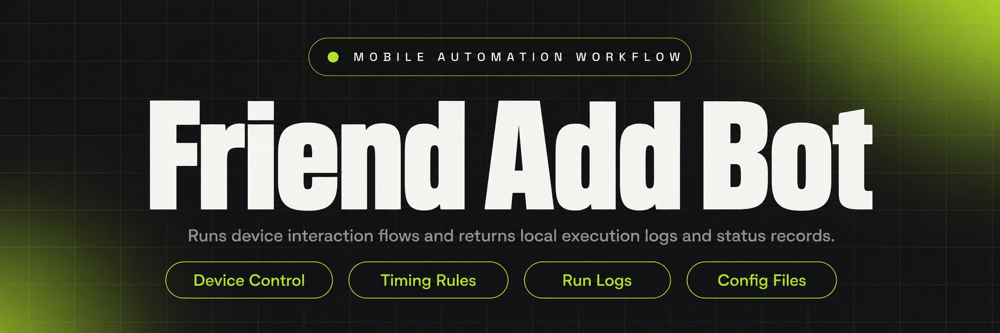
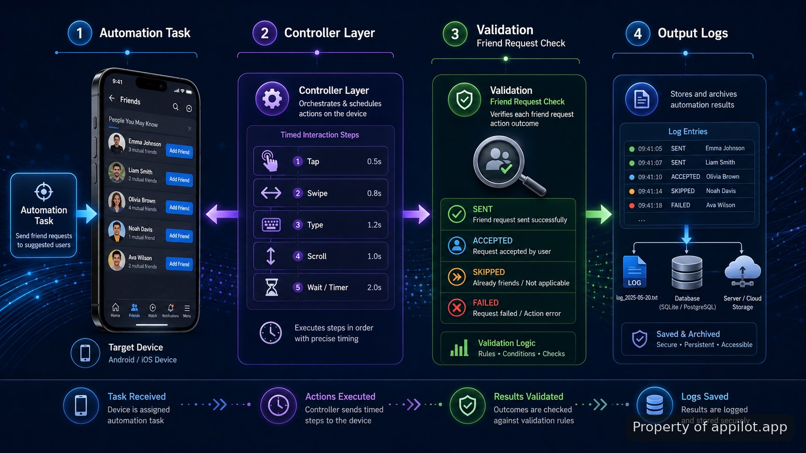

<p align="center">
  <a href="https://www.appilot.app" target="_blank" rel="nofollow">
    
  </a>
</p>

## snapchat bots to add

snapchat bots to add is a reference repository for demonstrating how a device-based automation flow can handle friend request actions on physical mobile hardware. The project focuses on the mechanics behind running interactions on real Android or iOS devices instead of relying on emulators. It shows the structure of a workflow that opens the application, performs defined actions, applies timing rules, and records results.

> A reference implementation for real-device interaction flows and mobile automation patterns.

The repository is designed for developers evaluating how mobile automation systems are organized. It separates device control, action sequences, timing behavior, and output handling so each part of the run can be inspected. The implementation is not intended to bypass platform restrictions or replace official application usage. Snapchat's Terms of Service restrict unauthorized automation, so this project demonstrates architecture and learning patterns rather than a production deployment path.

<a href="https://www.appilot.app" target="_blank" rel="nofollow">
  
</a>

<p align="center">
  <a href="https://t.me/Bitbash333" target="_blank" rel="nofollow">
    
  </a>&nbsp;
  <a href="https://wa.me/923249868488?text=Hi%2C%20I%27m%20interested." target="_blank" rel="nofollow">
    
  </a>&nbsp;
  <a href="mailto:hello@appilot.app" target="_blank" rel="nofollow">
    
  </a>&nbsp;
  <a href="https://www.appilot.app" target="_blank" rel="nofollow">
    
  </a>
</p>



## Real-device automation workflow

Many mobile automation experiments fail because they focus only on scripts and ignore the environment where actions occur. This repository treats the phone as the execution layer. A connected device receives commands, the controller manages the sequence, and recorded events provide visibility into what happened during a run. The approach follows patterns used in mobile testing frameworks such as <a href="https://developer.android.com/docs" target="_blank" rel="nofollow">Android's developer documentation</a> and <a href="https://developer.apple.com/documentation/" target="_blank" rel="nofollow">Apple's developer resources</a>.

A typical run begins with a prepared device session, continues through navigation and interaction steps, and ends with stored execution details. For example, a test run may load a predefined list of accounts to review, open the relevant application screen, perform the configured action sequence, and write completion information into a local log file. The repository keeps these stages separate because failures are easier to identify when device connection, action control, and reporting are not mixed together.

| Feature | Description |
| --- | --- |
| Physical Device Control | Removes the gap between simulated actions and actual hardware by running interaction flows on connected Android or iOS devices. |
| Friend Request Actions | Handles the defined request workflow sequence so developers can examine how add-request interactions are represented. |
| Timing Controls | Reduces rigid scripted behavior by allowing delays and pacing rules that mimic human interaction timing. |
| Run Logging | Keeps execution records so completed steps, failures, and device responses can be reviewed after a session. |
| Modular Workflow Stages | Separates setup, actions, validation, and output handling so individual parts of the automation process can be tested. |

## Mobile automation stack

The stack is organized around device access, automation control, and local execution. The project uses concepts from established mobile automation tooling rather than attempting to create a replacement platform. Device sessions follow approaches documented by <a href="https://appium.io/docs/en/latest/" target="_blank" rel="nofollow">Appium's official documentation</a> and browser or mobile testing practices described by <a href="https://www.selenium.dev/documentation/" target="_blank" rel="nofollow">Selenium documentation</a>.

The repository uses Python for orchestration because it keeps workflow definitions readable and allows automation logic to be separated from device-specific handling. Configuration files store runtime settings, while controller modules manage action order. Local storage keeps logs and generated files available for inspection after a run.

| Component | Role |
| --- | --- |
| Python runtime | Runs workflow logic, coordinates modules, and manages execution order. |
| Device bridge layer | Connects automation commands with physical mobile hardware. |
| Configuration files | Stores device settings, timing values, and workflow parameters. |
| Local logging | Captures run status and output details for debugging. |

```text
mobile-automation-reference/
├── src/
│   ├── runner.py
│   ├── device_controller.py
│   ├── interaction_flow.py
│   └── timing.py
├── config/
│   └── settings.yaml
├── logs/
│   └── run_history.json
├── requirements.txt
└── README.md
```

## Friend request workflow

The main workflow addresses a common automation problem: repeating the same mobile interaction sequence manually makes testing and evaluation difficult. The repository models a controlled sequence where each action has a defined place in the run. A request action is not treated as a single command; it is part of a chain that includes device preparation, navigation, interaction timing, and result capture.

A sample flow can start with a connected device identifier, continue with a loaded action list, and finish by saving execution output. The output is designed for review rather than hidden background operation. A developer can inspect which stage executed, where a step failed, and whether timing rules were applied.

```bash
python src/runner.py --config config/settings.yaml

Output:
Run complete
Actions processed: 25
Log written: logs/run_history.json
```

<a href="https://tally.so/r/yP5oDx?platform=GitHub&amp;format=Product+repo&amp;brand=Appilot&amp;niche=appilot&amp;page=Snapchat+Bots+To+Add+on+Android%2FiOS&amp;date=2026-09-03" target="_blank" rel="nofollow">
  
</a>

## Human interaction timing

Fixed-speed scripts can create unrealistic testing behavior because every action happens at the same interval. The timing module demonstrates configurable pauses between events, allowing developers to study how pacing affects a device interaction sequence. It does not claim to make automated activity identical to a person or remove platform enforcement.

The timing layer stores delays as configuration values instead of hardcoding them throughout the workflow. A run can therefore be inspected and adjusted during development. This structure is useful when analyzing mobile automation behavior, debugging action order, or building controlled demonstrations on dedicated devices.

## Use Cases

- Developers studying mobile interaction patterns can use the repository to understand how physical devices, controllers, and logs fit together.
- QA practitioners testing mobile workflow concepts can review how repeated interaction sequences are organized and recorded.
- Automation engineers evaluating device-based approaches can examine the separation between actions, timing rules, and execution output.

## snapchat bots to add

**STEP 1 — Download & Set Up the Project** Download, set up, and install **snapchat bots to add** from the repository files, then configure the local environment for device execution.

**STEP 2 — Connect Device** Open the project runner and connect the prepared Android or iOS hardware session used for the automation flow.

**STEP 3 — Configure Inputs** Select workflow settings, device values, and timing parameters inside the configuration file before starting the run.

**STEP 4 — Run And Review Output** Trigger the runner command, then review execution logs and saved run history files generated by the process.

## Repository outputs and limitations

The repository produces local execution records rather than a hosted service. The main outputs are workflow logs, configuration-driven run details, and captured status information. This makes the project useful as a reference when examining how automation components communicate.

The project does not provide a method for avoiding platform rules, hiding automated behavior, or operating outside permitted usage. Snapchat automation may violate platform rules depending on how it is used, and production environments should follow the applicable terms. The architecture shown here is intended for technical evaluation and controlled development scenarios.

## Mobile platform references

Developers working with device automation should understand the underlying mobile platform rules and testing frameworks. The following references provide background on supported development approaches: <a href="https://developer.android.com/training/testing" target="_blank" rel="nofollow">Android testing documentation</a>, <a href="https://developer.apple.com/documentation/xctest" target="_blank" rel="nofollow">Apple XCTest documentation</a>, <a href="https://appium.io/docs/en/latest/" target="_blank" rel="nofollow">Appium documentation</a>, <a href="https://owasp.org/www-project-mobile-app-security-testing-guide/" target="_blank" rel="nofollow">OWASP Mobile Application Security Testing Guide</a>, and <a href="https://csrc.nist.gov/projects/mobile-security" target="_blank" rel="nofollow">NIST mobile security guidance</a>.

This repository is best viewed as a technical reference for understanding mobile automation structure. It provides the pieces needed to inspect a device-driven workflow: inputs, execution stages, timing behavior, and stored results.

## FAQ

### Does this automation run on emulators or real devices?

The demonstrated approach uses real Android or iOS hardware rather than emulators. The repository focuses on how a controller communicates with physical devices and records the result of each execution stage.

### Is Snapchat automation allowed by the platform rules?

Platform rules may restrict unauthorized automation activity. This repository is a reference implementation of architecture and interaction patterns, not a recommendation to operate automated activity against platform terms.

### What inputs and outputs does the repository demonstrate?

The project demonstrates configuration inputs such as device settings and timing parameters, then produces local execution records, status information, and run history files for review.

<table>
  <tr>
    <td align="center" width="33%">
      
      <p>This scraper helped me gather thousands of posts effortlessly. The setup was fast, and exports are super clean and well-structured.</p>
      <p><b>Nathan Pennington</b><br>Marketer<br>★★★★★</p>
    </td>
    <td align="center" width="33%">
      
      <p>What impressed me most was how accurate the extracted data is. Likes, comments, timestamps — everything aligns perfectly.</p>
      <p><b>Greg Jeffries</b><br>SEO Affiliate Expert<br>★★★★★</p>
    </td>
    <td align="center" width="33%">
      
      <p>It's by far the best tool I've used. Ideal for trend tracking, competitor monitoring, and influencer insights.</p>
      <p><b>Karan</b><br>Digital Strategist<br>★★★★★</p>
    </td>
  </tr>
</table>